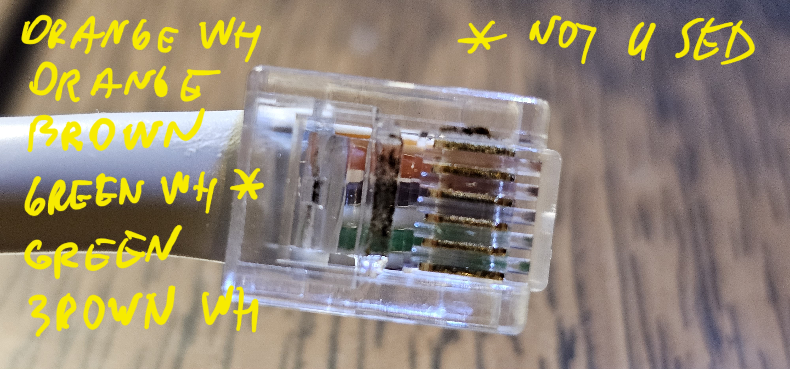

# esp32_p1meter
Software for the ESP32 (uPesy ESP32 Wroom Devkit) that decodes and sends P1 smart meter (DSMR) data to a MQTT broker, with the possibility for Over The Air (OTA) firmware updates.

## About this fork
This fork is based on work from [Brunas](https://github.com/Brunas/esp32_p1meter).
This fork is based on work from [bartwo](https://github.com/bartwo/esp32_p1meter).

How is this fork different from base:
- use platformio to configure the build and board
- Make MQTT sensors configured using JSON map with all available data and get MQTT sensors created dynamically.


## Setup
This setup requires:
- An ESP32 : I have used [wemos_d1_mini32](https://nl.aliexpress.com/item/1005006031354162.html) 
- A 10k ohm resistor.
- A simple LED for debugging and appropriate resistor for it for more information read [here](https://kitronik.co.uk/blogs/resources/which-resistor-should-i-use-with-my-led).
- A 6 pin RJ11 cable created from UTP cable and soldered directly to the kit. 4 pin version should work too but in Lithuania it's hard to have external power for the device in the meter box.

Setting up your Arduino IDE:
- Ensure you have selected the right board (you might need to install your esp32board in the Arduino IDE).
- Using the Tools->Manage Libraries... install `PubSubClient`, `ArduinoJson` and `tiny-collections`. For email debugging install `EmailSender` library.
- I have tested this on the 240 MHz and 160 MHz CPU frequency mode, pick either one. It has worked but not for long 😁. I've added `CPU_FREQ` constant to set CPU frequency to as low value as your board supports to assign more power from P1 port to the most important WiFi connection. In my case it's 80 MHz. It has been working well since the change due to no heavy calculations in the code.
- I have also added `TURNE_OFF_WIFI_PS` define disabled WiFi power saving by executing `esp_wifi_set_ps(WIFI_PS_NONE)`. Comment it out if you think WiFi connection will be stable.
- Copy file `template.settings.h` to `settings.h` and change values accordingly in it.
- Write to your device via USB the first time, you can do it OTA all times thereafter.

### Circuit diagram
I have used the UART0 : RXD pin on the ESP32 that also uses the USB port on ESP32. There is a risk of conflicts
Connect the ESP32 to an RJ12 cable/connector following the diagram.

| P1 pin   | ESP32 Pin |
| ----     | ---- |
| 1 - 5v out | 5v or Vin |
| 2 - RTS  | 3.3v |
| 3 - GND  | GND  |
| 4 -      |      |
| 5 - RXD (data) | UART0 : RXD (gpio01) |
| 6 - GND  | GND  |


>**_NOTE:_**  The diagram says `D1 mini` but all of this can be applied to ESP32 too.

On most models a 10K resistor should be used between the ESP's 3.3v and the P1's DATA (RXD) pin. Many howto's mention RTS requires 5V (VIN) to activate the P1 port, but for me 3V3 suffices.




<details><summary>Optional: Simpler 4 pin cable without power from your DSMR5+ meter</summary>
<p>
If you have how to power ESP32, a 4 pin cable is OK.

| P1 pin   | ESP32 Pin |
| ----     | ---- |
| 2 - RTS  | 3.3v |
| 3 - GND  | GND  |
| 4 -      |      |
| 5 - RXD (data) | UART0 : RXD (gpio01) |


>**_NOTE:_**  The diagram says `D1 mini` but all of this can be applied to ESP32 too.

</p>
</details>

### Data Sent

All metrics are send to their own MQTT topic. The software outputs all the topics through the Serial monitor when starting up
Example:

```
p1_meter/sensor/active_energy_import
p1_meter/sensor/clock
p1_meter/sensor/reactive_energy_import
p1_meter/sensor/reactive_energy_export
p1_meter/sensor/active_energy_import_rate_1
p1_meter/sensor/active_energy_import_rate_2
p1_meter/sensor/active_energy_export_rate_1
p1_meter/sensor/active_energy_export_rate_2
p1_meter/sensor/reactive_energy_rate_1
p1_meter/sensor/reactive_energy_rate_2
p1_meter/sensor/reactive_energy_minusr_rate_1
p1_meter/sensor/reactive_energy_minusr_rate_2
p1_meter/sensor/instantaneous_voltage_l1
p1_meter/sensor/average_voltage_l1
p1_meter/sensor/instantaneous_current_l1
p1_meter/sensor/sliding_average_current_l1
p1_meter/sensor/instantaneous_voltage_l2
p1_meter/sensor/average_voltage_l2
p1_meter/sensor/instantaneous_current_l2
p1_meter/sensor/sliding_average_current_l2
p1_meter/sensor/instantaneous_voltage_l3
p1_meter/sensor/average_voltage_l3
p1_meter/sensor/instantaneous_current_l3
p1_meter/sensor/sliding_average_current_l3
p1_meter/sensor/instantaneous_voltage
p1_meter/sensor/instantaneous_current
p1_meter/sensor/instantaneous_current_in_neutral
p1_meter/sensor/instantaneous_current_sum_over_all_phases
p1_meter/sensor/instantaneous_net_frequency_any_phase
p1_meter/sensor/instantaneous_active_power
p1_meter/sensor/instantaneous_active_import_power_in_phase_l1
p1_meter/sensor/instantaneous_active_import_power_in_phase_l2
p1_meter/sensor/instantaneous_active_import_power_in_phase_l3
p1_meter/sensor/instantaneous_active_export_power_in_phase_l1
p1_meter/sensor/instantaneous_active_export_power_in_phase_l2
p1_meter/sensor/instantaneous_active_export_power_in_phase_l3
p1_meter/sensor/instantaneous_reactive_import_power_in_phase_l1
p1_meter/sensor/instantaneous_reactive_import_power_in_phase_l2
p1_meter/sensor/instantaneous_reactive_import_power_in_phase_l3
p1_meter/sensor/instantaneous_reactive_export_power_in_phase_l1
p1_meter/sensor/instantaneous_reactive_export_power_in_phase_l2
p1_meter/sensor/instantaneous_reactive_export_power_in_phase_l3
p1_meter/sensor/instantaneous_apparent_import_power
p1_meter/sensor/instantaneous_apparent_import_power_in_phase_l1
p1_meter/sensor/instantaneous_apparent_import_power_in_phase_l2
p1_meter/sensor/instantaneous_apparent_import_power_in_phase_l3
p1_meter/sensor/instantaneous_apparent_export_power
p1_meter/sensor/instantaneous_apparent_export_power_in_phase_l1
p1_meter/sensor/instantaneous_apparent_export_power_in_phase_l2
p1_meter/sensor/instantaneous_apparent_export_power_in_phase_l3
p1_meter/sensor/average_import_power
p1_meter/sensor/average_net_power
p1_meter/sensor/average_total_power
p1_meter/sensor/instantaneous_power_factor
p1_meter/sensor/instantaneous_power_factor_in_phase_l1
p1_meter/sensor/instantaneous_power_factor_in_phase_l2
p1_meter/sensor/instantaneous_power_factor_in_phase_l3
p1_meter/sensor/minimum_power_factor
p1_meter/sensor/demand_register_1_active_energy_import
p1_meter/sensor/demand_register_2_active_energy_export
p1_meter/sensor/demand_register_3_reactive_energy_import
p1_meter/sensor/demand_register_4_reactive_energy_export
p1_meter/sensor/demand_register_5_apparent_energy_import
p1_meter/sensor/demand_register_6_apparent_energy_export
p1_meter/sensor/last_average_demand_register_1_active_energy_import
p1_meter/sensor/last_average_demand_register_2_active_energy_export
p1_meter/sensor/last_average_demand_register_3_reactive_energy_import
p1_meter/sensor/last_average_demand_register_4_reactive_energy_export
p1_meter/sensor/last_average_demand_register_5_apparent_energy_import
p1_meter/sensor/last_average_demand_register_6_apparent_energy_export
p1_meter/sensor/number_of_power_failures_in_any_phase
p1_meter/sensor/duration_of_last_voltage_sag_in_phase_l1
p1_meter/sensor/duration_of_last_voltage_sag_in_phase_l2
p1_meter/sensor/duration_of_last_voltage_sag_in_phase_l3
p1_meter/sensor/magnitude_of_last_voltage_sag_in_phase_l1
p1_meter/sensor/magnitude_of_last_voltage_sag_in_phase_l2
p1_meter/sensor/magnitude_of_last_voltage_sag_in_phase_l3
p1_meter/sensor/duration_of_last_voltage_swell_in_phase_l1
p1_meter/sensor/duration_of_last_voltage_swell_in_phase_l2
p1_meter/sensor/duration_of_last_voltage_swell_in_phase_l3
p1_meter/sensor/magnitude_of_last_voltage_swell_in_phase_l1
p1_meter/sensor/magnitude_of_last_voltage_swell_in_phase_l2
p1_meter/sensor/magnitude_of_last_voltage_swell_in_phase_l3
```

All the metrics you need are easily added in `DSMR_MAP` variable in `dsmr_map.h` file. With the `DEBUG` mode it's possible to see all the topics you add/create in the serial monitor. Also, it's possible to configure topic structure by changing `MQTT_ROOT_TOPIC` value in `settings.h` file.
There is additional `TEST` mode to try your setup with test telegram and actual MQTT message send while your adapter is not connected to P1 port. 
`EMAIL_DEBUGGING` is used to send debug messages to any email, e.g. GMail address. This is might be usefull to trace what's going on when device is connected to P1 port and actual debugging using USB port is impossible.
Additionally, I've implemented `MQTT_DEBUGGING` mode to allow sending debug messages to MQTT topic defined by `MQTT_DEBUG_TOPIC`.

### Home Assistant Configuration

Use this [example](assets/mqtt.yaml) for home assistant's `mqtt.yaml` which must be included in main `configuration.yaml` as follows:
```yaml
mqtt: !include mqtt.yaml
```
